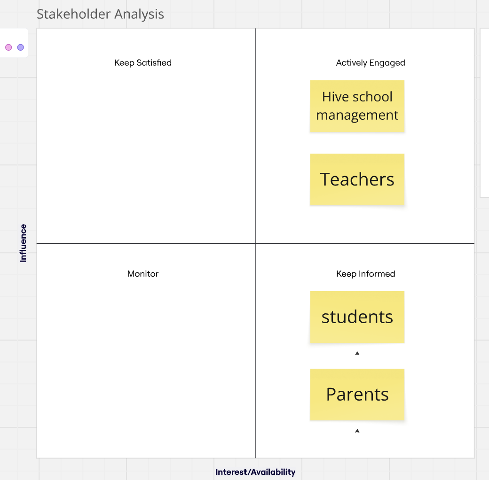
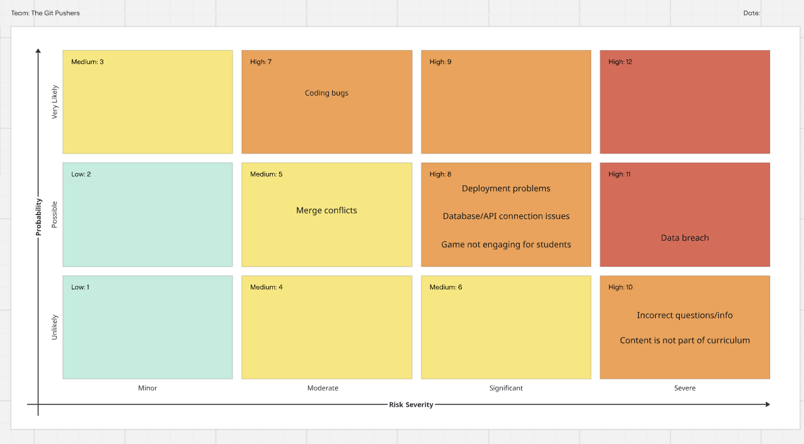
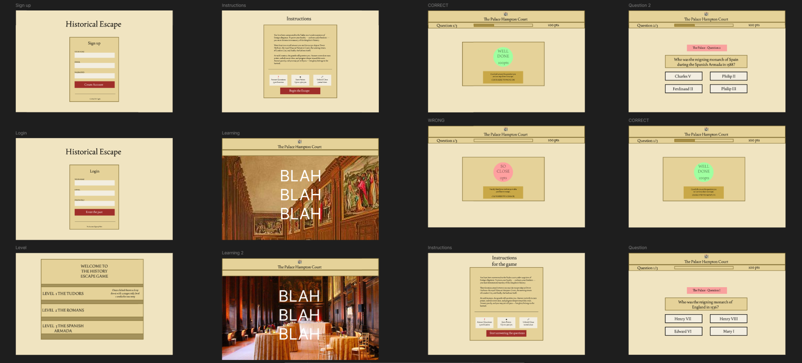
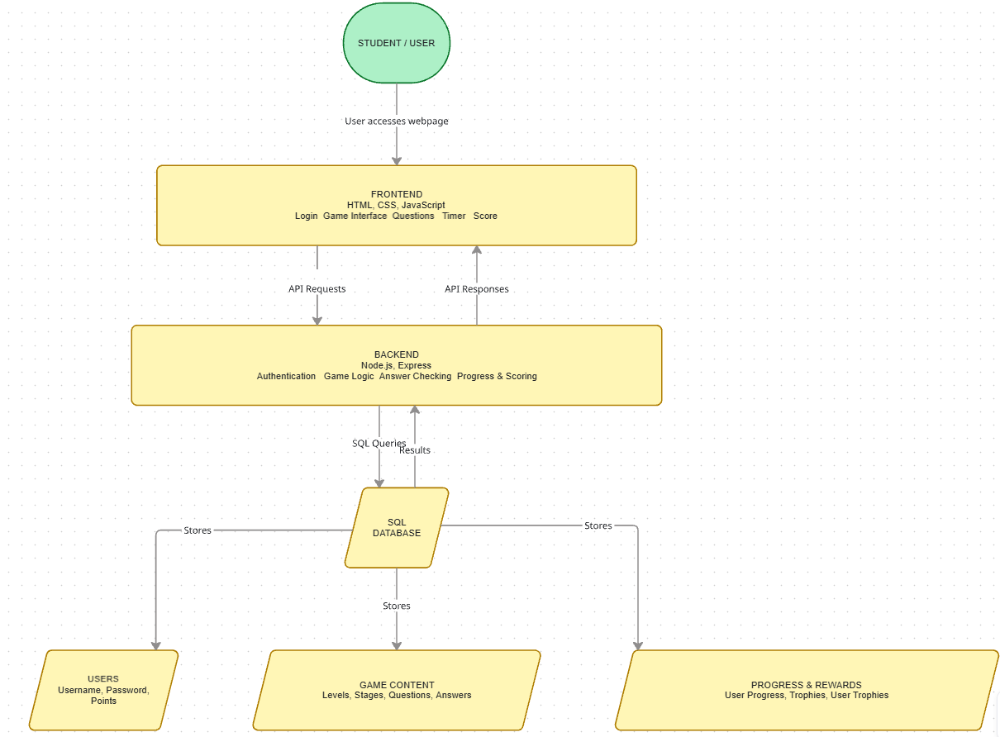
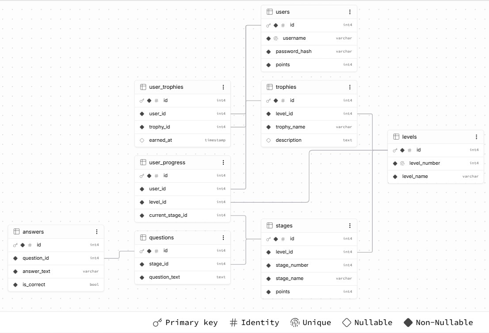
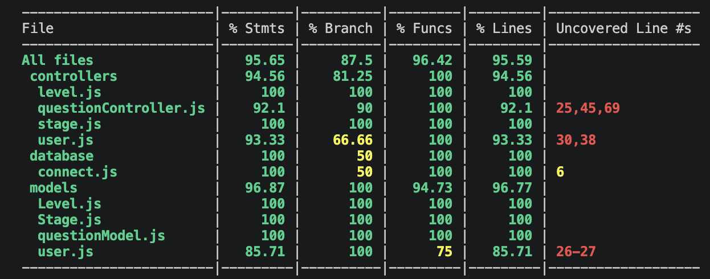

# Educational Game Project - History Escape

## Project Description

History Escape is an educational game designed to make learning History more interactive and enjoyable for secondary school students.

The game places students within a period of history where they must use their knowledge to progress through different stages and escape before time runs out.

Rather than completing a standard quiz, questions form part of a historical mission, giving students a reason to apply what they have learned.

---

## Problem Statement

The management team of the Hive group of secondary schools has noticed a lack of engagement in non-STEM subjects over the last two years.

They would like to reverse this trend and have asked for a solution that places student enjoyment at the heart of the learning experience.

Stakeholder research also identified concerns around students struggling to retain key knowledge and lessons becoming repetitive.

---

## Our Solution

Our solution is **History Escape**, a story-based educational game that combines History learning with an escape-style challenge.

Students are placed within a historical event and must learn key information before answering questions and completing challenges to progress through the game.

For our MVP, we focused specifically on **Tudor England and Henry VIII**.

The player travels back to **1536**, where Anne Boleyn has been imprisoned and is facing execution. The player's mission is to use their knowledge of Henry VIII and Tudor England to rescue Anne before it is too late and escape back to the present.

---

## MVP

Our MVP is a short, story-based History game where students:

- Create an account and log in.
- Enter a historical level.
- Complete a short crash course containing the information needed for the mission.
- Progress through different stages of the game.
- Answer History questions based on what they have learned.
- Complete the mission before time runs out.

### Level 1 - Henry VIII

The first level focuses on Henry VIII and Tudor England.

The player travels back to Tudor England in 1536 with the mission of rescuing Anne Boleyn.

The level contains four stages:

1. **Henry VIII and His Wives**
2. **Henry VIII and the Male Heir**
3. **The English Reformation**
4. **Henry VIII and the Church**

Questions are stored in the database and used during the game to test the player's knowledge.

---

## Features

- User signup and login.
- Story-based History gameplay.
- Educational crash-course content.
- Multiple stages within each level.
- Timed gameplay.
- History question bank stored within the database.
- User progress tracking.
- Trophy and reward system.
- SQL database containing users, levels, stages, questions and answers.
- Frontend connected to a backend API.

---

## Stakeholder Analysis

We identified four main stakeholder groups: Hive management, teachers, students and parents.



### Hive Management / CEO

Hive commissioned the project and wants to improve engagement in non-STEM subjects. They therefore have a high level of interest and influence over whether the solution meets the needs of the schools.

### Teachers

Teachers are directly affected by low student engagement and difficulties with knowledge retention. They would also play an important role in determining whether the game is educationally useful.

### Students

Students are the main users of History Escape, making their enjoyment and experience extremely important. However, they have less influence over decisions about which educational tools are adopted by the school.

### Parents

Parents have an interest in their children's engagement, enjoyment and progress at school, but have less direct influence over the design and implementation of the game.

---

## Solution Analysis

We considered several possible solutions to improve student engagement with non-STEM subjects.

### History Game

- A choose-your-own-adventure game where students experience History as a character within that period.
- Questions and challenges are included within the story.

### Geography Game

- A child-friendly game inspired by GeoGuessr.
- Students use clues and interesting facts to identify places around the world.

### Multi-Subject Quiz

- Students choose between different subjects, each with its own question bank.
- A general trivia-style game covering multiple non-STEM subjects.

### Chosen Solution - History Escape

We chose **History Escape** because it allowed us to combine education, storytelling and gameplay.

Rather than using a standard quiz, History questions form part of an escape mission, making learning more interactive and enjoyable.

We also chose to initially focus on **one subject area** so we could create a stronger and more realistic MVP within the one-week project timeframe. The concept can later be expanded to include other historical periods and non-STEM subjects.

---

## Risk Analysis

During planning, we identified potential risks that could affect the delivery of the project and considered their likelihood, impact and possible mitigation.



- **Coding bugs** - Could break features and delay development.
- **Merge conflicts** - Team members may edit the same code, causing conflicts.
- **Deployment problems** - Configuration differences could prevent the application from running correctly.
- **Database/API issues** - Could stop the frontend, backend and database communicating.
- **Game not engaging** - The project fails its main goal if students do not enjoy it.
- **Data breach** - Could expose sensitive user information.
- **Incorrect information** - Students could learn inaccurate historical content.
- **Not part of curriculum** - Content may not support what students are required to learn.

---

## User Stories

User stories were created to help us understand the application from the user's perspective and identify the features required for the MVP.

- **As a student, I want to create an account so that I can access the game.**
- **As a student, I want to log in so that I can play using my account.**
- **As a student, I want to start a History game so that I can test my knowledge.**
- **As a student, I want to see multiple-choice questions so that I can select an answer.**
- **As a student, I want to know whether my answer is correct so that I can learn from my mistakes.**
- **As a student, I want to earn points for correct answers so that the game feels rewarding.**
- **As a student, I want to see my final score so that I know how well I performed.**
- **As a student, I want to see a leaderboard so that I can compare my score with others.** *(Could Have)*

---

## Wireframes

Wireframes were created before development to plan the layout and user journey of the application.



---

## High-Level Solution

History Escape is a full-stack application consisting of a **frontend, backend API and SQL database**.

The frontend allows the user to interact with the game and communicates with the backend through HTTP requests.

The backend was created using Node.js and Express. It handles application logic, authentication and communication with the database.

The PostgreSQL database stores application data including users, game levels, stages, questions, answers, progress and trophies.



---

## Database Design

We used a relational PostgreSQL database to store the data required by the application.

The database includes data relating to:

- Users
- Levels
- Stages
- Questions
- Answers
- User progress
- Trophies
- User trophies

The main game content follows the relationship:

`Level → Stage → Question → Answers`



---

## Installation & Usage

### Installation

1. Clone the repository:

```bash
git clone <repository-url>
```

2. Navigate to the API folder:

```bash
cd api
```

3. Install the dependencies:

```bash
npm install
```

4. Create a `.env` file inside the `api` folder and add the required environment variables:

```env
PORT=<your-port>
DB_URL=<your-database-url>
```

5. Set up and seed the database:

```bash
npm run setup-db
```

6. Start the server:

```bash
npm run dev
```

### Usage

Once the application is running:

- Create an account or log in.
- Select level 1 and read the learning content before beginning the mission (stage 1)
- Answer multiple-choice questions to progress through the game.
- Earn points for correct answers.
- Complete the mission before the timer runs out.
- View your final score.

---

## Technologies Used

### Frontend

- HTML
- CSS
- JavaScript

### Backend

- Node.js
- Express.js

### Database

- PostgreSQL
- SQL

### Authentication

- bcrypt
- JSON Web Tokens (JWT)

### Testing

- Jest
- Supertest

### Collaboration & Project Management

- Git
- GitHub

---

## Project Structure

```text
educational-game-project/
│
├── api/
│   ├── controllers/
│   ├── database/
│   ├── middleware/
│   ├── models/
│   ├── routers/
│   ├── __tests__/
│   ├── api.js
│   ├── index.js
│   └── package.json
│
├── client/
│   ├── assets/
│   ├── css/
│   ├── html/
│   └── js/
│
├── img/
├── .gitignore
├── README.md
```

---

## Process

We worked as a team of five using Agile methodologies throughout the project.

We:

- Analysed the project brief and stakeholder requirements.
- Considered different solutions before agreeing on History Escape.
- Defined our MVP and created user stories.
- Created wireframes to plan the user journey.
- Designed the database structure.
- Used GitHub to organise and assign tasks.
- Held daily stand-ups to discuss progress and blockers.
- Used GitHub branches and pull requests to collaborate.
- Developed the frontend, backend and database.
- Connected the different parts of the application.
- Tested and debugged the application throughout development.

---

## Wins & Challenges

### Wins

- Developed a full-stack educational game within a one-week sprint.
- Created a frontend, backend API and relational SQL database.
- Connected the frontend, backend and database.
- Worked collaboratively using Git branches and pull requests.
- Used Agile working practices to manage the project.
- Created an MVP based on the needs identified through stakeholder analysis.

### Challenges

- Managing dependencies between the frontend, backend and database.
- Resolving Git and merge conflicts while working collaboratively.
- Debugging issues when integrating different features.
- Managing the scope of the project within a one-week timeframe.

---

## Testing

We used **Jest** and **Supertest** to test the application.

Our aim was to achieve at least **60% test coverage**.

**Final test coverage:** `ADD FINAL TEST COVERAGE %`



---

## Bugs

Known bugs at the time of submission:

- `Add confirmed bug here`
- `Add confirmed bug here`

If there are no known major bugs at the time of submission, this section will be updated to reflect this.

---

## Future Features

With more development time, History Escape could include:

- Additional historical periods and levels.
- Additional non-STEM subjects, such as Geography.
- A leaderboard where students can compare scores.
- More questions and challenges within each level.
- Additional trophies and rewards.
- Improved user progress tracking.
- More interactive graphics and animations.
- Improved accessibility features.
- Logout and home button features.

